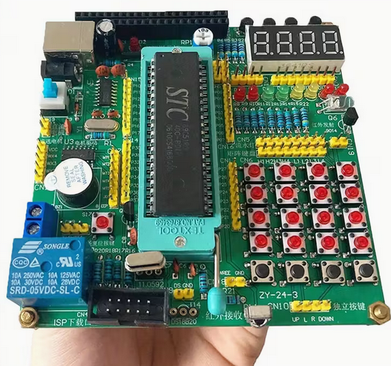

# STC89C52 Development Environment 
## MD Harrington BexleyHeath  London UK DA68NP

 <p align = "center" >

</p> 


A complete development environment for programming STC89C52 microcontrollers on Linux systems. This project includes automated setup, compilation, and upload tools with a simple Makefile-based workflow.

## 📋 Table of Contents

- [Overview](#overview)
- [Features](#features)
- [Prerequisites](#prerequisites)
- [Quick Start](#quick-start)
- [Project Structure](#project-structure)
- [Detailed Usage](#detailed-usage)
- [Code Explanation](#code-explanation)
- [Troubleshooting](#troubleshooting)
- [Hardware Setup](#hardware-setup)
- [License](#license)
- [Info Re My Self](#Personal_links)

## 🎯 Overview

This project provides a streamlined workflow for developing embedded applications on the STC89C52 microcontroller using the SDCC (Small Device C Compiler) and stcgal programmer. It includes:

- Automated setup script for installing all dependencies
- Example LED blink program in C
- Professional Makefile with multiple build targets
- Automatic serial port detection
- Assembly code generation and viewing

## ✨ Features

- **One-command setup** - Automated installation of all tools and dependencies
- **Auto-detection** - Automatically finds your USB-to-serial adapter
- **Build verification** - Checks for required tools before compiling
- **Assembly viewing** - See the generated 8051 assembly code
- **Multiple upload modes** - Auto-detect or manual port specification
- **Clean workflow** - Organized build targets with clear feedback
- **Comprehensive help** - Built-in documentation via `make help`

## 📦 Prerequisites

- **Operating System**: Debian-based Linux (Ubuntu, Debian, Linux Mint, etc.)
- **Hardware**: STC89C52 microcontroller
- **Adapter**: USB-to-serial adapter (CH340, CP2102, FTDI, etc.)
- **Permissions**: sudo access for package installation

## 🚀 Quick Start

### Step 1: Run the Setup Script

```bash
# Download and run the setup script
chmod +x setup_stc89c52.sh
./setup_stc89c52.sh
```

The setup script will:
1. ✅ Verify you're on a Linux system
2. ✅ Update and upgrade your system packages
3. ✅ Install SDCC compiler
4. ✅ Install Python3 and setuptools
5. ✅ Clone and install stcgal programmer
6. ✅ Add your user to the `dialout` group for serial port access
7. ✅ Create a project directory with example code
8. ✅ Generate `blink.c` and `Makefile`

**Important**: After setup, log out and back in for serial port permissions to take effect.

### Step 2: Navigate to Project Directory

```bash
cd ~/stc89c52_project
```

### Step 3: Build Your Project

```bash
make
```

This compiles `blink.c` and shows you the first 25 lines of generated assembly code.

### Step 4: Upload to Microcontroller

```bash
# Connect your STC89C52 via USB-to-serial adapter, then:
make upload
```

The Makefile will automatically detect your serial port and upload the firmware.

## 📁 Project Structure

```
stc89c52_project/
├── blink.c          # Example LED blink program
├── Makefile         # Build automation script
├── blink.hex        # Generated firmware (after build)
├── blink.asm        # Generated assembly code (after build)
└── blink.lst        # Listing file with addresses (after build)
```

## 🔧 Detailed Usage

### Building

```bash
# Compile and show assembly preview
make

# Just check if tools are installed
make check-tools

# Show build configuration
make info
```

### Uploading

```bash
# Auto-detect serial port and upload
make upload

# Upload with specific baud rate
make upload BAUD=57600

# Manually specify serial port
make upload-manual PORT=/dev/ttyUSB0

# List available serial ports
make list-ports
```

### Assembly Viewing

```bash
# Show first 25 lines of assembly in terminal
make showasm

# Open full assembly file in VS Code
make asm
```

### Cleaning

```bash
# Remove all build artifacts
make clean
```

### Help

```bash
# Show all available commands
make help
```

## 📖 Code Explanation

### Setup Script (`setup_stc89c52.sh`)

The setup script automates the entire development environment installation:

**1. System Verification**
- Checks that you're running on a Linux system
- Warns if running as root (not recommended)

**2. System Updates**
```bash
sudo apt update        # Update package lists
sudo apt upgrade -y    # Upgrade installed packages
```

**3. Dependency Installation**
- **SDCC**: Small Device C Compiler for 8051 microcontrollers
- **Python3**: Required for stcgal
- **python3-setuptools**: Python package installer
- **git**: For cloning the stcgal repository
- **pip3**: Python package manager

**4. stcgal Installation**
```bash
git clone https://github.com/grigorig/stcgal.git
cd stcgal
sudo python3 setup.py install
```
stcgal is the programming tool that communicates with STC microcontrollers via serial port.

**5. User Permissions**
- Adds your user to the `dialout` group
- This allows access to `/dev/ttyUSB*` and `/dev/ttyACM*` devices without sudo
- **Requires logout/login to take effect**

**6. Project Creation**
- Creates `~/stc89c52_project` directory
- Generates `blink.c` example program
- Generates complete `Makefile`

### Blink Program (`blink.c`)

```c
#include <8051.h>  // SDCC 8051 header
```
Includes the SDCC header for 8051 microcontroller registers and definitions.

```c
void delay_ms(unsigned int ms) {
    unsigned int i, j;
    for (i = 0; i < ms; i++)
        for (j = 0; j < 120; j++); // Rough delay loop
}
```
Simple software delay function. The nested loops create approximately a 1ms delay per iteration (calibrated for typical 8051 clock speeds).

```c
void main(void) {
    P1 = 0x00; // Set port 1 as output
```
Initializes Port 1 by setting all pins to LOW (0V).

```c
    while (1) {
        P1 ^= 0x01;   // Toggle P1.0 (pin for LED)
        delay_ms(500);
    }
```
Infinite loop that:
- Toggles bit 0 of Port 1 (P1.0) using XOR operation (`^=`)
- Waits 500ms
- Result: LED connected to P1.0 blinks at 1 Hz (on for 500ms, off for 500ms)

### Makefile

The Makefile automates the build and upload process with multiple intelligent features:

**Variables**
```makefile
TARGET = blink           # Project name
SRC = $(TARGET).c        # Source file
CC = sdcc                # Compiler
UPLOAD = stcgal          # Upload tool
BAUD = 115200            # Serial baud rate
```

**Auto Port Detection**
```makefile
PORT := $(shell ls /dev/ttyUSB* 2>/dev/null | head -n 1)
ifeq ($(PORT),)
    PORT := $(shell ls /dev/ttyACM* 2>/dev/null | head -n 1)
endif
```
Automatically finds USB-to-serial adapters by checking `/dev/ttyUSB*` first, then `/dev/ttyACM*`.

**Build Process**
1. **Tool Check**: Verifies SDCC, packihx, and stcgal are installed
2. **Compilation**: `sdcc -mmcs51 --code-size 8192 blink.c`
   - `-mmcs51`: Target 8051 architecture
   - `--code-size 8192`: Set 8KB code memory size (STC89C52 spec)
3. **Hex Generation**: Converts Intel HEX format for uploading
4. **Assembly Preview**: Shows first 25 lines of generated assembly

**Upload Process**
- Checks if serial port is detected
- Calls stcgal with detected port and baud rate
- Displays progress and status messages

## 🔍 Troubleshooting

### Serial Port Not Detected

**Problem**: `make upload` says "No serial device found"

**Solution**:
```bash
# Check if your adapter is connected
make list-ports

# If nothing appears, check dmesg
dmesg | tail -20

# Manually specify port
make upload-manual PORT=/dev/ttyUSB0
```

### Permission Denied on Serial Port

**Problem**: "Permission denied" when accessing `/dev/ttyUSB0`

**Solution**:
```bash
# Check if you're in dialout group
groups

# If "dialout" is not listed, add yourself
sudo usermod -a -G dialout $USER

# Log out and back in for changes to take effect
```

### SDCC Not Found

**Problem**: `sdcc: command not found`

**Solution**:
```bash
sudo apt update
sudo apt install sdcc
```

### stcgal Not Found

**Problem**: `stcgal: command not found`

**Solution**:
```bash
# Reinstall stcgal
pip3 install stcgal

# Or use the original method
git clone https://github.com/grigorig/stcgal.git
cd stcgal
sudo python3 setup.py install
```

### Upload Fails or Timeout

**Problem**: stcgal times out during upload

**Solution**:
1. **Power cycle the microcontroller** - STC chips need to be reset during upload
2. **Check baud rate** - Try lower rates: `make upload BAUD=57600`
3. **Check connections**:
   - TX → RX
   - RX → TX
   - GND → GND
4. **Verify chip model** - Ensure you have an STC89C52 (not STC89C51 or other variant)

### Build Errors

**Problem**: Compilation errors in your code

**Solution**:
```bash
# Clean build files and try again
make clean
make

# Check the listing file for detailed errors
cat blink.lst
```

## 🔌 Hardware Setup

### Basic LED Blink Circuit

```
STC89C52          LED           Resistor
   P1.0 ─────────────►|─────────[220Ω]────── GND
```

**Components**:
- 1× STC89C52 microcontroller
- 1× LED (any color)
- 1× 220Ω resistor (or 330Ω)
- 1× USB-to-serial adapter (CH340, CP2102, FTDI, etc.)

**Connections**:
1. Connect LED anode (+) to P1.0 (Pin 1)
2. Connect LED cathode (-) to 220Ω resistor
3. Connect resistor to GND
4. Connect USB-to-serial adapter:
   - TX → RXD (Pin 10)
   - RX → TXD (Pin 11)
   - GND → GND (Pin 20)
5. Connect 5V power to VCC (Pin 40) and GND (Pin 20)

### Upload Mode

To upload firmware to STC microcontrollers:
1. Start the upload command: `make upload`
2. **Power cycle the chip** (disconnect and reconnect power)
3. stcgal will detect the chip and upload firmware
4. The chip will automatically start running the new program

## 📚 Additional Resources

- [SDCC Documentation](http://sdcc.sourceforge.net/)
- [stcgal GitHub](https://github.com/grigorig/stcgal)
- [STC89C52 Datasheet](http://www.stcmicro.com/datasheet/STC89C52RC_en.pdf)
- [8051 Architecture Guide](https://www.engineersgarage.com/8051-microcontroller-architecture/)

## 🤝 Contributing

Feel free to submit issues and pull requests to improve this development environment.

## 📄 License

This project is provided as-is for educational and development purposes.

---

**Made with ❤️ for embedded systems enthusiasts**


## Personal Links  for further reference 

- **FaceBook** 
- https://www.facebook.com/mark.harrington.14289/

- **Instagram** https://www.instagram.com/markukh2021/ 

- **X Formerly Twitter** https://x.com/MarkHar11467143

### My own website 
- **Elite Projects** https://eliteprojects.x10host.com/
 
